# 2021년 1학기 졸업프로젝트

## Each Person

[김민철](https://github.com/alscjf909)
[이원규](https://github.com/dnjsrb0710)
[표승완](https://github.com/ghtydnty1)
[신준철](https://github.com/ewsn1593)
[홍성목](https://github.com/swff07183)
## Useful Links  
- [Youtube Download](https://ko.savefrom.net/1-%EC%9C%A0%ED%8A%9C%EB%B8%8C-%EB%B9%84%EB%94%94%EC%98%A4-%EB%8B%A4%EC%9A%B4%EB%A1%9C%EB%93%9C-%ED%95%98%EB%8A%94-%EB%B0%A9%EB%B2%95.html)
- [Transform MP4 to GIF](https://ezgif.com/)
- [Server](/server/server.md)

## Agenda  
- [Torch Study](https://github.com/KNU-BrainAI-Capstone2021/CaptainGyu/tree/main/torch_train)
- [GAN Study](https://github.com/KNU-BrainAI-Capstone2021/CaptainGyu/tree/main/paper)
- [GAN dataset make Face 68 landmark](https://github.com/KNU-BrainAI-Capstone2021/CaptainGyu/tree/main/facent-pytorch)

## Our Progress....

### [Pytorch Study](https://github.com/KNU-BrainAI-Capstone2021/CaptainGyu/tree/main/vanila_gan)  

### [DCGAN Study](https://github.com/KNU-BrainAI-Capstone2021/CaptainGyu/blob/main/paper/1511.06434.pdf)

  

　  

### MTCNN(To tracked face)  
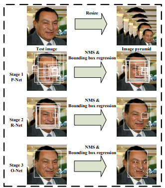  
|MTCNN_P-net|MTCNN_R-net|MTCNN_O-net|
|----|-----|----|
|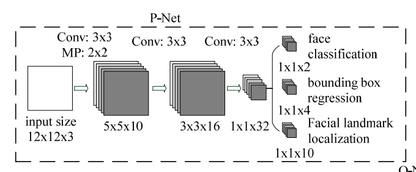||

[MTCNN구조 참고자료](https://yeomko.tistory.com/16)

 

|Before|After|
|------|---|
|  ||
|||

### Face Landmark

여러 face detection model에서 각자의 FPS를 비교해보았다.  
|.|MTCNN|dlib|dlib-cnn|
|---|------|---|----|
|result|  |||
|FPS||||

### AutoEncoder
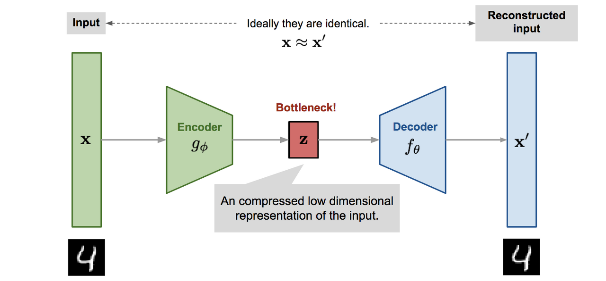 

AutoEncoder 실습 결과

| |ANN|CNN|
|---|------|---|
|result|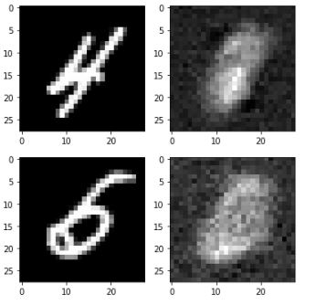  |

+ [ANN코드](autoencoder/ANN_autoencoder.py)
+ [CNN코드](autoencoder/CNN_autoencoder.py)

### Model construction (DF structure)  

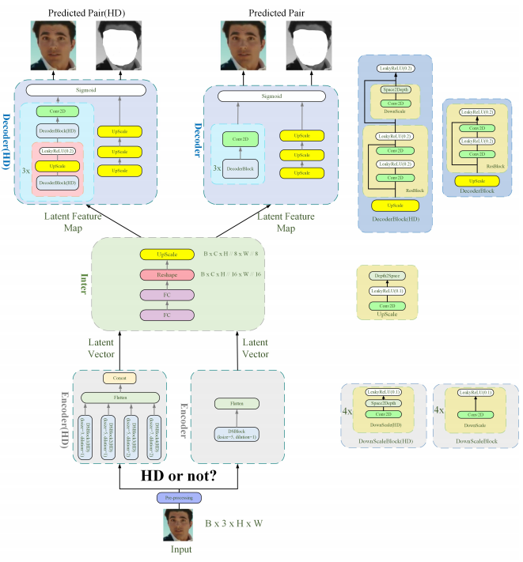  
  
[DF 네트워크 코드](model/network.py)  

### Model Training  
논문에서는 `MSE + Structural Dissimilarity` 를 `Loss`로 사용하고 있다.  
기존 `torch`에 구현되어 있지 않아 따로 코드를 작성하였다.  
[Custom Loss (MSE + DISSIM) 작성 코드](model/DFLoss.py)  
  
실제 학습과 Conversion을 수행하는 코드와 이 과정에서 사용되는 함수를 분리하여 코드를 작성하였다.  
[Training_util 코드](model/Train_util.py)  
[Conversion_util 코드](model/Conversion_util.py)    
[Training Conversion 코드](model/Train_Conversion.py)  

Training Loss 변화 관측 결과  
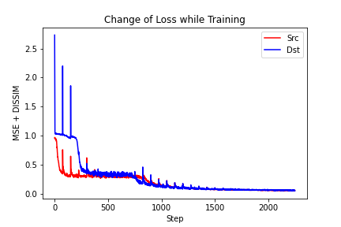

### blending 
+ poisson blending

source 와 target의 경계면에서의 피부 톤을 match 시키기 위해 본 프로젝트에서는 poisson blending을 사용한다. 
+ Laplacian of Gaussian(LoG) , Laplacian mask

|LOG|mask|
|---|---|
|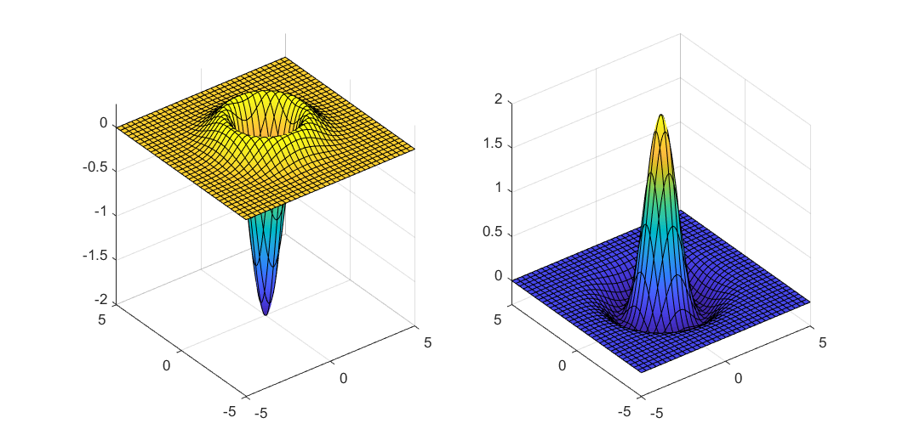  |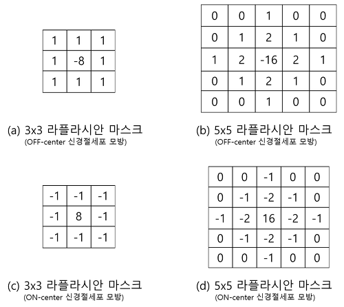 |

+ Test

|source|mask|target|
|---|------|---|
|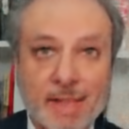  |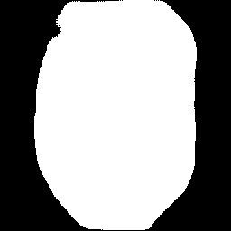|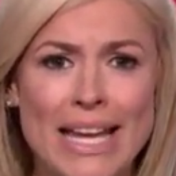

#### blending result

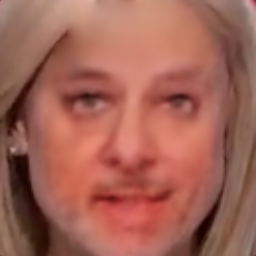

[Blender코드](Blending/poisson_blender.py)

### Conversion
