# CaptainGyu

### [2021년 1학기 졸업프로젝트](1st_Semester.md)
 

## 2021년 2학기 졸업프로젝트

## Plan
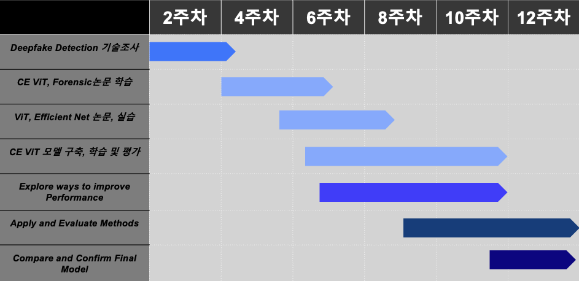

## Each Person
[이원규](https://github.com/dnjsrb0710)
[표승완](https://github.com/ghtydnty1)
[신준철](https://github.com/ewsn1593)
[홍성목](https://github.com/swff07183)

## Useful Links  
- [Youtube Download](https://ko.savefrom.net/1-%EC%9C%A0%ED%8A%9C%EB%B8%8C-%EB%B9%84%EB%94%94%EC%98%A4-%EB%8B%A4%EC%9A%B4%EB%A1%9C%EB%93%9C-%ED%95%98%EB%8A%94-%EB%B0%A9%EB%B2%95.html)
- [Transform MP4 to GIF](https://ezgif.com/)
- [Server](/server/server.md)

## Agenda  

- [EfficientNet](https://arxiv.org/pdf/1905.11946.pdf)
- [An Image is Worth 16x16 Words- Transformers for Image Recognition at Scale](https://arxiv.org/pdf/2010.11929.pdf)
- [Attention Is All You Need](https://arxiv.org/pdf/1706.03762.pdf)

## Our Progress....

### Cross Efficient Vision Transformer

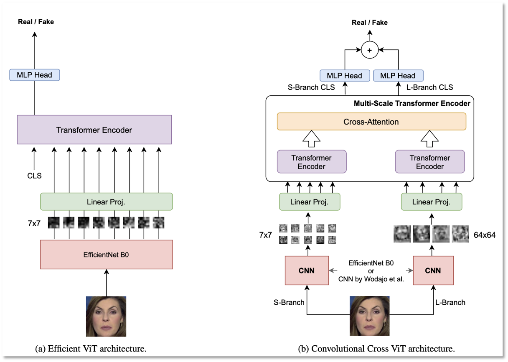
 

### EfficientNet
#### [EfficientNet 실습코드](2nd_Semester/EfficientNet/EfficientNet.ipynb)

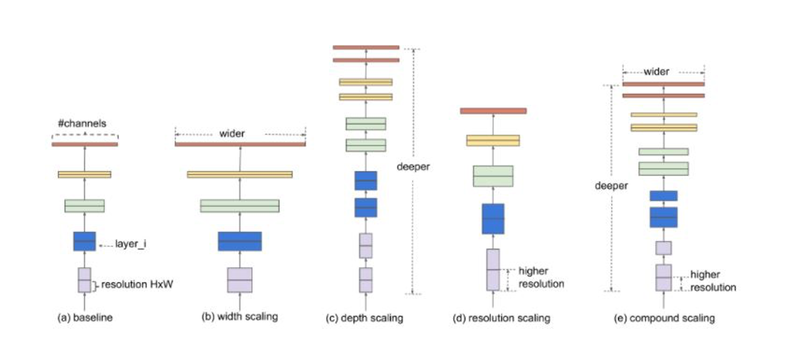
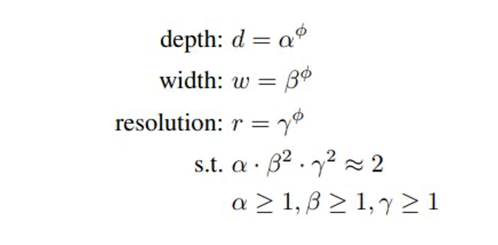
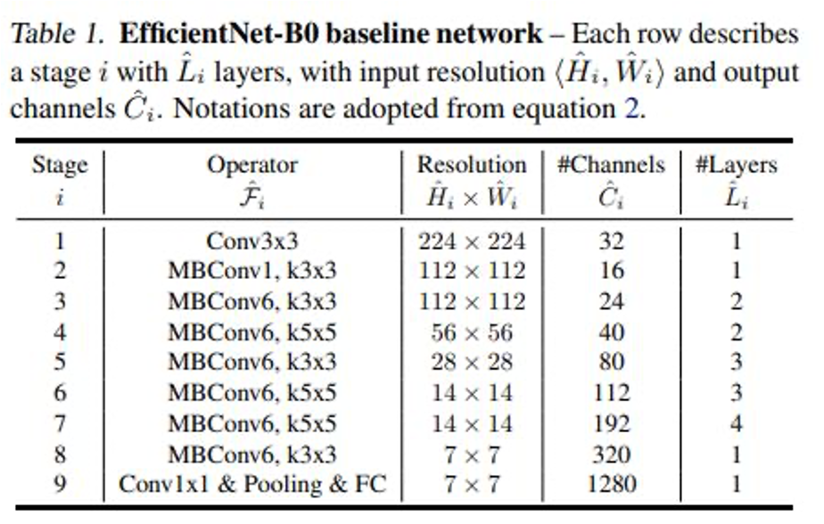
#### MBconv Block
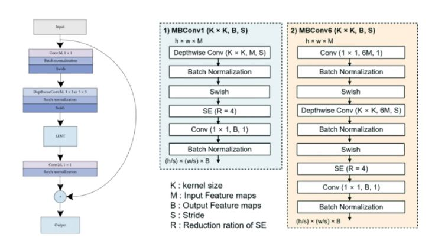
 

What is [Inverted residual block](2nd_Semester/img/inverted_residual.JPG) / [Depthwise conv](2nd_Semester/img/depthwise.JPG) / [Swish function](2nd_Semester/img/swish.JPG) / [SENET](2nd_Semester/img/senet.JPG) ?

 

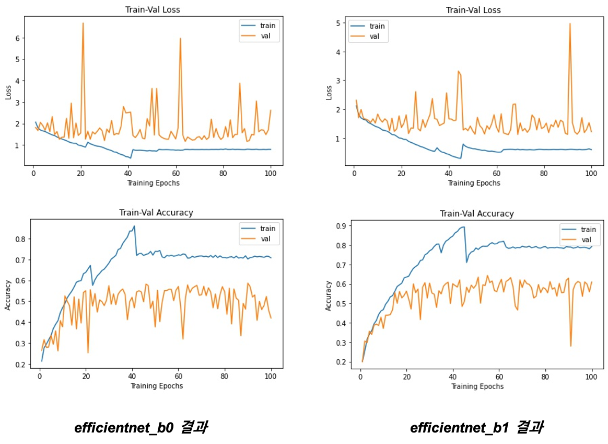

 

### VisionTransformer

#### [VisionTransformer 실습코드](2nd_Semester/VisionTransformer/VisionTransformer.ipynb)

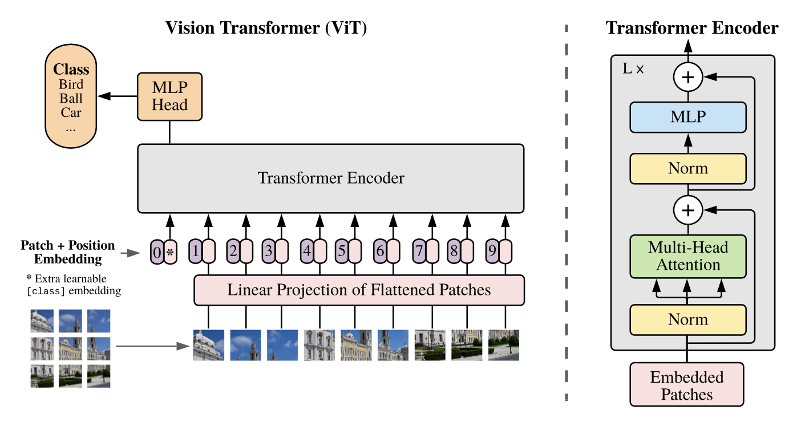

 

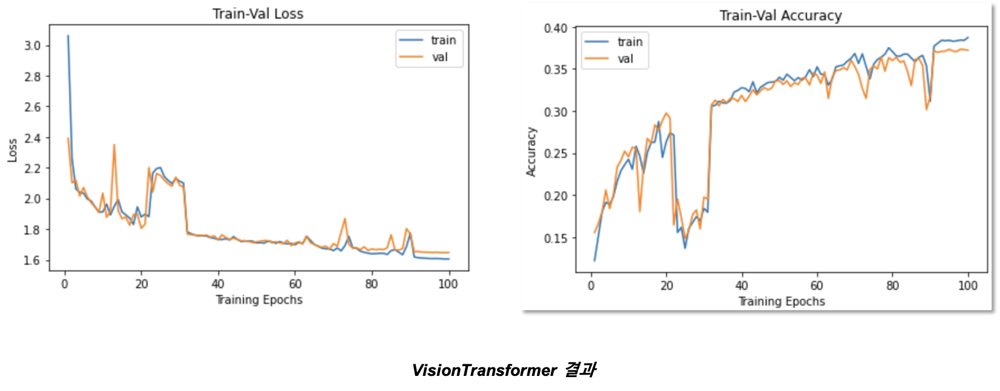

### Result - Cross Efficient VIT(pre-trained model)

#### Face Forencsics++ dataset(20)
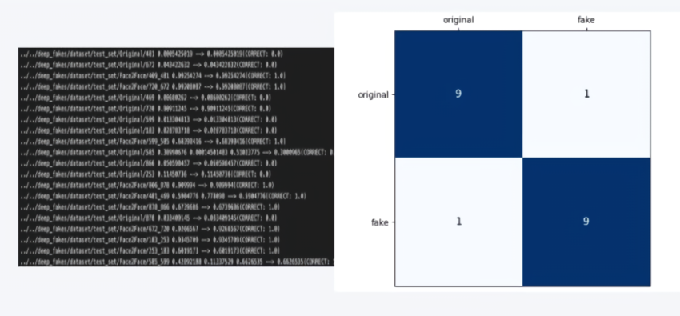

#### Our dataset(2) - from semester 1
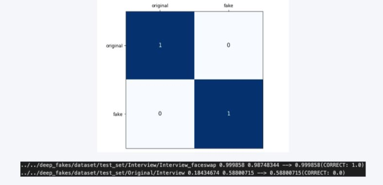
