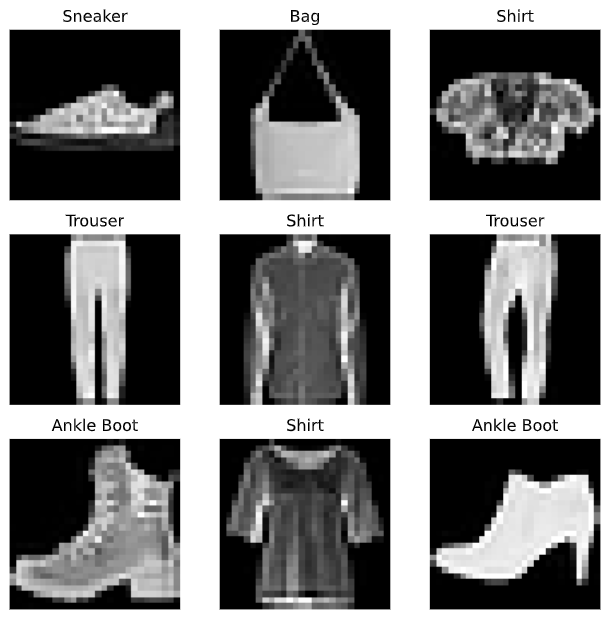

# 2021년 1학기 졸업프로젝트

## Each Person

[김민철](https://github.com/alscjf909)
[이원규](https://github.com/dnjsrb0710)
[표승완](https://github.com/ghtydnty1)
[신준철](https://github.com/ewsn1593)
[홍성목](https://github.com/swff07183)
## Useful Links  
- [Youtube Download](https://ko.savefrom.net/1-%EC%9C%A0%ED%8A%9C%EB%B8%8C-%EB%B9%84%EB%94%94%EC%98%A4-%EB%8B%A4%EC%9A%B4%EB%A1%9C%EB%93%9C-%ED%95%98%EB%8A%94-%EB%B0%A9%EB%B2%95.html)
- [Transform MP4 to GIF](https://ezgif.com/)
- [Server](/server/server.md)

## Agenda  
- [Torch Study](https://github.com/KNU-BrainAI-Capstone2021/CaptainGyu/tree/main/torch_train)
- [GAN Study](https://github.com/KNU-BrainAI-Capstone2021/CaptainGyu/tree/main/paper)
- [GAN dataset make Face 68 landmark](https://github.com/KNU-BrainAI-Capstone2021/CaptainGyu/tree/main/facent-pytorch)

## Our Progress....

### [Pytorch Study](https://github.com/KNU-BrainAI-Capstone2021/CaptainGyu/tree/main/vanila_gan)  

### [DCGAN Study](https://github.com/KNU-BrainAI-Capstone2021/CaptainGyu/blob/main/paper/1511.06434.pdf)

  

　  

### MTCNN(To tracked face)  
|MTCNN_P-net|MTCNN_R-net|MTCNN_O-net|
|----|-----|----|
|||

[MTCNN구조 참고자료](https://yeomko.tistory.com/16)

 

|Before|After|
|------|---|
|  ||
|||

### Face Landmark

여러 face detection model에서 각자의 FPS를 비교해보았다.  
|.|MTCNN|dlib|dlib-cnn|
|---|------|---|----|
|result|  |||
|FPS||||

### AutoEncoder
 

AutoEncoder 실습 결과

| |ANN|CNN|
|---|------|---|
|result|  |

### Model construction (DF structure)

