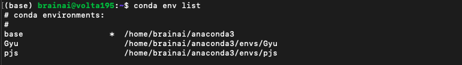
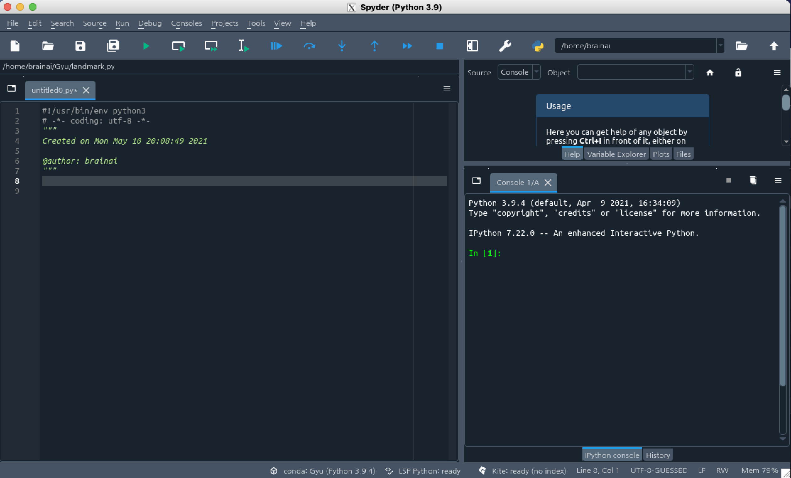

# 서버 접속하기


#### [Use Spyder in Linux Servers](https://www.notion.so/210509-c0f02dbb10d447889f5c3a8c9555a4f3#d000a91fbec94da6baf05cb06927f89c)


##### 155.230.26.195 volta 195

 ID : brainai
PW : 053-950-5544


1. Create a virtual env

```
$ conda create -n Gyu
```

2. Check virtual env list

```
$ conda env list
```




3. Activate a virtual env

```
$ conda activate Gyu
```


4. Type "Spyder"

```
$ spyder
```

